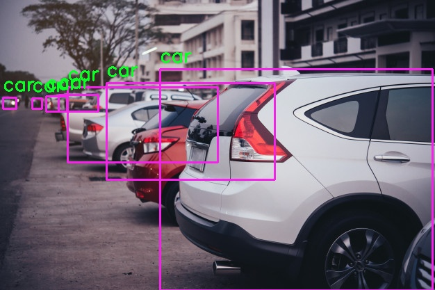

# How to detect objects in a picture and classify them using OpenVINO<sup>TM</sup> with Python

Toby McClean 

[✉️ toby.mcclean@adlinktech.com](mailto:toby.mcclean@adlinktech.com)
[🔗 https://www.linkedin.com/in/tobymcclean/](https://www.linkedin.com/in/tobymcclean/)

------

The computer vision capability we're highlighting in this tutorial is object detection, using networks that have been trained on large datasets, to detect and classify objects.

The application accepts an input image and outputs an image with bounding boxes around the detected objects. 

As an example, we provide a Python version of the application.

## Code Explained

Now, we are going to walk through creating a new application, from scratch, in Python for object detection, called `ov-detection.py`. The application will load an abritary image from disk and classify it using a detection network such as `SSD with MobileNet V2`

### Setting up the Project

You can store the `ov-detection.py` file that we will be creating wherever you want on your device. For simplicity, this guide will create it, along with some test images inside a directory under the user's home directory; `~/edge-inference-intro`.

Run the following commands from a terminal to create the directory and files.

```bash
$ cd ~/
$ mkdir edge-inference-intro
$ cd edge-inference-intro
$ touch ov-detection.py
$ wget https://github.com/tobymcclean/edge-aiot-resources/raw/master/imgs/cars_parked2.jpg
```

Some test images are downloaded to the folder with the `wget` commands above. Please note if the directory `~/edge-inference-intro` already exists then the command `mkdir edge-inference-intro` will fail, this is not an issue, continue as normal.  

### Download Pretrained Model

```bash
$ cd ~/edge-inference-intro

$/opt/intel/openvino/deployment_tools/tools/model_downloader/downloader.py --name ssd_mobilenet_v2_coco

$/opt/intel/openvino/deployment_tools/tools/model_downloader/converter.py --name ssd_mobilenet_v2_coco
```


Next, we'll add the Python code for the program to the empty source file we created here.

### Imports

Add `import` statements to load the modules we will use for classifying images.

```python
import argparse
import sys
import os
import logging as log

import cv2
import numpy as np

from openvino.inference_engine import IENetwork, IECore
```


| Import                    | Description                                                  |
| ------------------------- | ------------------------------------------------------------ |
| argparse                  | Package for parsing the command line                         |
| sys                       | Package with system specific constants and functions         |
| os                        | Package that provides a portable way of using operating system dependent functionality |
| cv2                       | Python binding for OpenCV used to read and write images from disk |
| numpy                     | Package for scientific computing, in this application we use it for working with an image |
| logging                   | Package for flexible event logging including logging levels  |
| openvino.inference_engine | Python binding for OpenVINO which is used for classifying images |

### Parse arguments

Next, add some code to parse the command line arguments supported by the application.  There are two mandatory arguments: the image to be classified (```-i``` or ```--ifile```) and the model to use for classification (```-m``` or ```--model```.)

```python
parser = argparse.ArgumentParser(add_help=True)
parser.add_argument('-i', '--ifile', type=str, required=True,
                    help='Required. Filename of the image to load and classify')
parser.add_argument('-m', '--model', type=str, required=True,
                    help='Required. Path to the model to use for classification. Should end in .xml')
parser.add_argument('-o', '--ofile', type=str, required=False,
                    help='Optional. Filename to write the annotated image to', default=None)
parser.add_argument('-l', '--labels', type=str, required=False,
                    help='Optional. Filename of the class id to label mappings', default=None)
parser.add_argument('-d', '--device', type=str, required=False,
                    help='Optional. Specify the target device to infer on: CPU, GPU, MYRIAD or HETERO.', default='CPU')
parser.add_argument('-x', '--extension', type=str, required=False,
                    help='Optional. Extension for custom layers.', default=None)

args = parser.parse_args()
args = vars(args)
```

The application also accepts the following optional arguments: 

* A filename to write an image with the top classification and confidence level (```-o``` or ```--ofile```)
* A filename for a file that maps the class id to a human readable label (```-l``` or ```--labels```)
* The device to use to run the model (```-d``` or ```--device```). The value must be one of ```CPU```, ```GPU```, ```MYRIAD``` or ```HETERO```. The default is ```CPU```.
* A library of extensions (```-x``` or ```--device```) for the engine to use with custome layers. The default is None.

For example, to run the application

```
python ov-detection.py -m public/ssd_mobilenet_v2_coco/FP32/ssd_mobilenet_v2_coco.xml -x /opt/intel/openvino/inference_engine/lib/intel64/libcpu_extension.dylib -i car1.jpeg
```

### Create the OpenVINO<sup>TM</sup> Inference Engine

The following code will load the provided classification model with OpenVINO<sup>TM</sup>. The [OpenVINO<sup>TM</sup> documentation](https://software.intel.com/en-us/openvino-toolkit/documentation/pretrained-models) provides a list of pre-trained models for performing classifications. 

In this article we will continue to use SSD with MobileNet V2 which can classify the 80 different categories; see [coco_classes.txt](coco_classes.txt) for the list of categories. The classes include:

* different kinds of vehicles,
* different species of animals,
* different kinds of sports equipment,
* different kinds of everyday objects,
* etc.

```python
model_xml = args['model']
model_bin = os.path.splitext(model_xml)[0] + '.bin'

ie = IECore()
net = IENetwork(model=model_xml, weights=model_bin)
```


We can then ensure that the device that will execute the model supports all of the layers in the model.

```python
supported_layers = ie.query_network(net, args['device'])
not_supported_layers = [l for l in net.layers.keys() if l not in supported_layers]

if len(not_supported_layers) != 0:
    log.error('...The following layers are not supported by the device.\n {}'.format(', '.join(not_supported_layers)))

```

The application that we are building only supports models that have a single input and a single output. So again we will verify that this condition is met.

```python
assert len(net.inputs.keys()) == 1, 'The application supports single input topologies.'
assert len(net.outputs) == 1, 'The application supports single output topologies'
```

Finally, we instantiate an executable version of the model.

```python
exec_net = ie.load_network(network=net, device_name=args['device'])
```

### Load an image into memory

We now need to load the image that will be classified and ensure that it is the right size and in the right format. Format example, OpenVINO models expect the data layout for an image to be channel, height, and width but images are loaded with a height, width, and channel data layout.

To dynamically resize the input image into the size required by the model we compute the dimensions of the models input layer.

```python
input_blob = next(iter(net.inputs))
out_blob = next(iter(net.outputs))
net.batch_size = 1
input_name = ''
input_info_name = ''
```

Set the precision of the input layer and verify that the network is one that we can handle in our application

```python
for input_key in net.inputs:
    if len(net.inputs[input_key].layout) == 4:
        input_name = input_key
        net.inputs[input_key].precision = 'U8'
    elif len(net.inputs[input_key].layout) == 2:
        input_info_name = input_key
        net.inputs[input_key].precision = 'FP32'
        if net.inputs[input_key].shape[1] != 3 and net.inputs[input_key].shape[1] != 6 or net.inputs[input_key].shape[
            0] != 1:
            log.error('Invalid input info. Should be 3 or 6 values length.')
```

Store the shape of the model input layer.

```python
n, c, h, w = net.inputs[input_blob].shape
```

Now we can use OpenCV to load the image and record the original image height and width.

```python
ifile = args['ifile']
images = np.ndarray(shape=(n, c, h, w))
images_hw = []

image = cv2.imread(ifile)
ih, iw = image.shape[:-1]
images_hw.append((ih, iw))
```

Resize the image if necessary.

```python
if image.shape[:-1] != (h, w):
    log.info(f'Image {ifile} has been resized from {image.shape[:-1]} to {(h, w)}')
    image = cv2.resize(image, (w, h))
```

Change the data layout of the loaded image

```python
image = image.transpose((2, 0, 1))
images[0] = image
```

### Detect Objects in the Image

We are ready for the most important part of detecting objects in the image. The inference engine expects the image to be included in a 4-dimensional array. The reason for this is sometimes models can process image in batches greater than one.

```python
res = exec_net.infer(inputs={input_blob: images})
```

### Process the Results

After the inference engine is executed with the input image a result is produced. The result contains a list of bounding boxes with a class and a confidence level. The confidence level is an indicator of how certain the model is the contents of the box are of the specified class.

```python
res = res[out_blob]
```

For each bounding box we collect the top-left corner and the bottom-right corner of the box. At the same time we need to calculate the position in the original image.

```python
for number, proposal in enumerate(data):
    if proposal[2] > 0:
        imid = np.int(proposal[0])
        ih, iw = images_hw[imid]
        label = np.int(proposal[1])
        confidence = proposal[2]
        xmin = np.int(iw * proposal[3])
        ymin = np.int(ih * proposal[4])
        xmax = np.int(iw * proposal[5])
        ymax = np.int(ih * proposal[6])
        print(f'[{number}, {label}] element, prob = {confidence:.6}     ({xmin}, {ymin})-({xmax}, {ymax}) batch id : {imid}', end="")
        if proposal[2] > 0.5:
            if not imid in boxes.keys():
                boxes[imid] = []
            boxes[imid].append([xmin, ymin, xmax, ymax])
            if not imid in classes.keys():
                classes[imid] = []
            classes[imid].append(label)
```

Load the labels into a map so that we can lookup a human-friendly label given the category id in the result.

```python
if args['labels']:
    with open(args['labels'], 'r') as f:
        labels_map = [x.split(sep=' ', maxsplit=1)[-1].strip() for x in f]
else:
    labels_map = None
```

Now for each of the bounding boxes draw it on the original image using the ```rectangle``` function from OpenCV.

```python
image = cv2.imread(ifile)
for imid in classes:
    for idx, box in enumerate(boxes[imid]):
        class_id = classes[imid][idx] - 1
        label = labels_map[class_id] if labels_map else class_id
        image = cv2.putText(image, f'{label}', (box[0], box[1] - 10), cv2.FONT_HERSHEY_SIMPLEX, 0.9, (36, 255, 12), 2)
        image = cv2.rectangle(image, (box[0], box[1]), (box[2], box[3]), (232, 35, 244), 2)
```

### Display the Image

We can now use OpenCV to display the original image with the bounding boxes.

```python
cv2.imshow('OV Detection', tmp_image)
cv2.waitKey(0)
cv2.destroyAllWindows()
```


## Running the Application

To run the application on an image ```cars_parked2.jpeg``` using the AlexNet (```alexnet.xml```) model:

```bash
$  python openvino/ov-detection.py -m public/ssd_mobilenet_v2_coco/FP32/ssd_mobilenet_v2_coco.xml -l coco_classes.txt -x /opt/intel/openvino/inference_engine/lib/intel64/libcpu_extension.dylib -i cars_parked2.jpeg
```

Which outputs

```
[ INFO ] Creating the argument parser...
[ INFO ] Loading model
[ INFO ] ... model file public/ssd_mobilenet_v2_coco/FP32/ssd_mobilenet_v2_coco.xml
[ INFO ] ... weights file public/ssd_mobilenet_v2_coco/FP32/ssd_mobilenet_v2_coco.bin
[ INFO ] Creating inference engine
[ INFO ] ...Checking that the network can be run on the selected device
[ INFO ] ...Checking that the network has a single input and output
[ INFO ] ...Loading the model
[ INFO ] Getting input information
[ INFO ] Loading image
[ INFO ] Image openvino/cars_parked2.jpg has been resized from (417, 626) to (300, 300)
[ INFO ] Starting inference in synchronous mode
[ INFO ] Processing the output blob
[ INFO ] Processing detected objects
[0, 3] element, prob = 0.952076     (97, 125)-(313, 233) batch id : 0
[1, 3] element, prob = 0.803333     (230, 99)-(622, 417) batch id : 0
[2, 3] element, prob = 0.641314     (46, 141)-(60, 156) batch id : 0
[3, 3] element, prob = 0.615026     (153, 119)-(395, 258) batch id : 0
[4, 3] element, prob = 0.587512     (4, 140)-(23, 156) batch id : 0
[5, 3] element, prob = 0.554931     (84, 136)-(141, 160) batch id : 0
[6, 3] element, prob = 0.54568     (66, 138)-(96, 160) batch id : 0
```



## Summary

We have built the ```Hello World``` of ```classification``` using OpenVINO<sup>TM</sup>.

